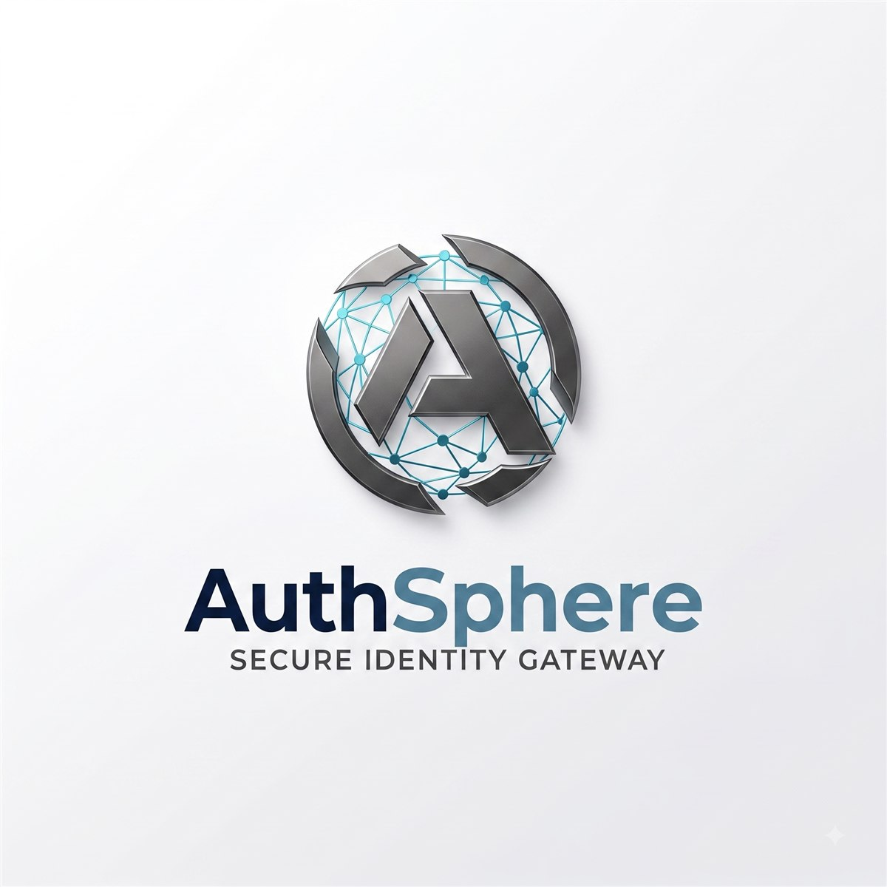

  

<h1 align="center" style="margin-top:8px;">AuthSphere</h1>

  <b>Building simple and reliable tools for developers.</b> 
  AuthSphere is an open-source organization focused on authentication, developer tools, and software infrastructure.

  
  
  

  

### 🚀 Projects

| Project | Description |
|---------|-------------|
| **AuthSphere** | Authentication and OAuth infrastructure |
| *More coming soon* | Stay tuned — new developer tools are in the works |

### 🤝 Community

  We believe in building useful software, keeping things simple, and learning in public. 
  Contributions and feedback are welcome — if you have an idea or spot an issue, open one!

  Built with ❤️ by the AuthSphere team

